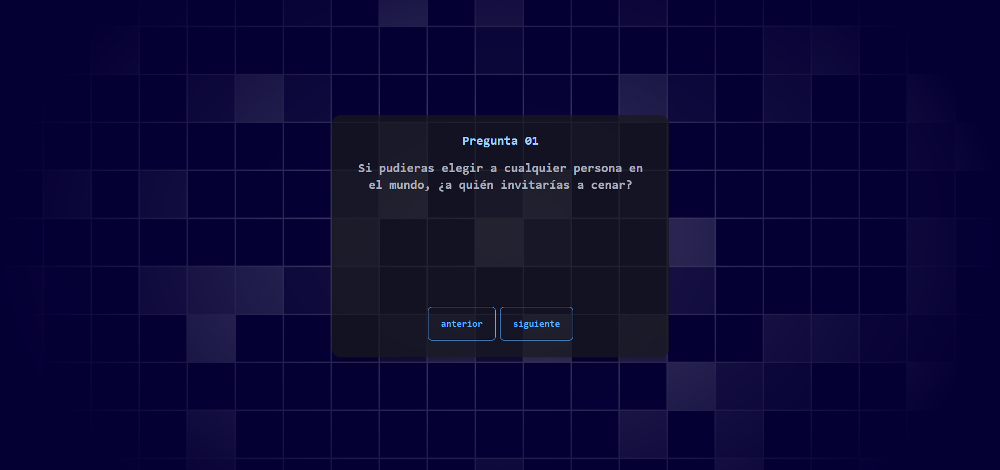

# Aumentar Cercanía




"Preguntas para aumentar la cercanía de las personas" (React + Vite + DaysiUI)

## Descripción

Estas preguntas están diseñadas para ayudar a las personas a sentirse más conectadas entre sí, ya sea que estén buscando profundizar una relación existente o establecer una nueva conexión.

## Instalación

Para instalar y ejecutar esta aplicacíon, necesitarás `node.js` y `npm`. Luego puedes seguir los siguientes pasos:

- Clona el repositorio
  ```
  git clone https://github.com/leugimkm/aumentar-cercania.git
  ```
- Navega al directorio del proyecto
  ```
  cd aumentar-cercania
  ```
- Instala las dependencias
  ```
  npm install
  ```
- Inicia el servidor de desarrollo
  ```
  npm run dev
  ```


## Contribución

Las contribuciones son bienvenidas. Por favor, abre un _issue_ o realiza un _pull request_ si deseas contribuir.

